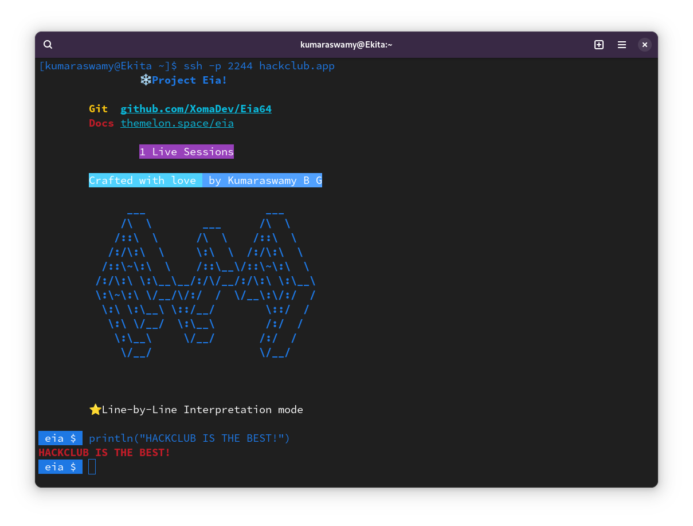

# Eia Playground




A demonstration utility for [Project Eia](https://github.com/XomaDev/Eia64).\
Built around SSH protocol, no credentials are required to connect to server.

## Usage

````shell
ssh -p 2244 hackclub.app
````

If you are connecting the first time, you need to enter "yes" to validate.

### Ports

- `2244` of `hackclub.app` line-by-line interpretation mode
- `2103` of `hackclub.app` for code buffer support

### Commands 

`Ctrl+E` runs the code\
`Ctrl+L` applies lexical analysis and prints the tokens\
`Ctrl+P` prints a parsed node output of lexed tokens\
`Ctrl+C` to disconnect from server


Hosted on `#nest`

Thank you,
Kumaraswamy B G